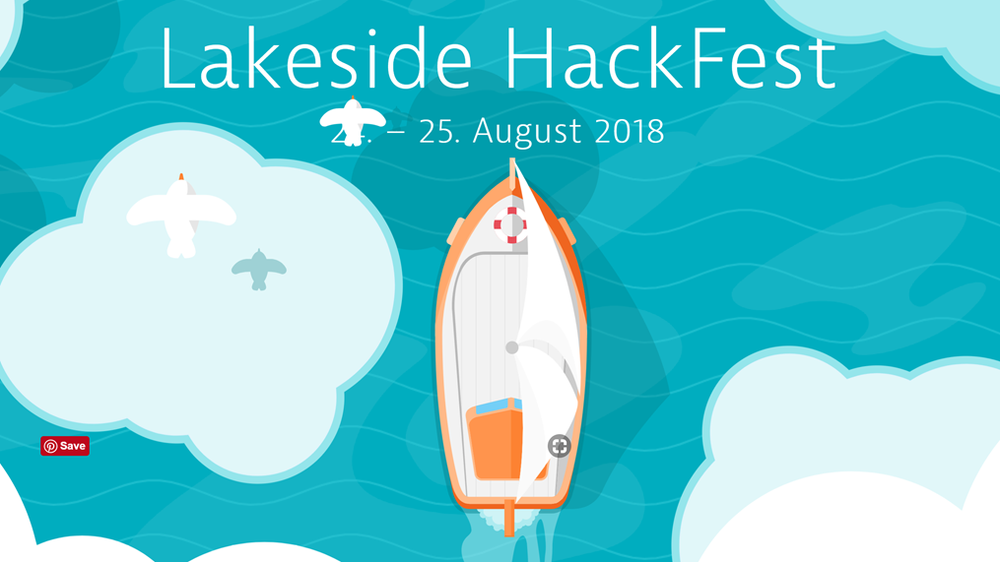
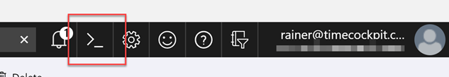
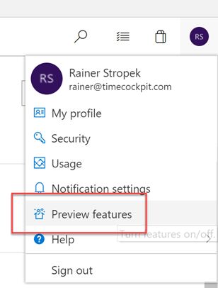
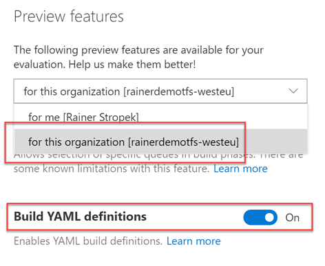
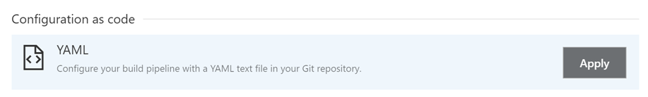
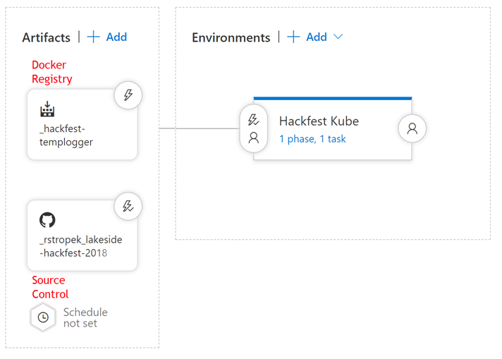
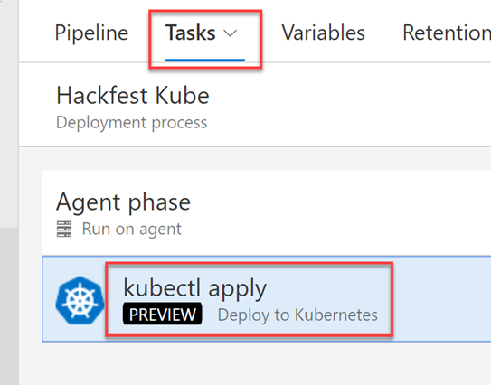

# Cloud-Native Microservices with .NET Core



## Introduction

This is the demo script for my session about *cloud-native .NET apps* at the [Lakeside Hackfest](https://www.lakeside-hackfest.com/). Here is the session's abstract:

> In this session, long-term Microsoft MVP and Regional Director Rainer Stropek talks about how .NET Core fits to this new way of software development. The workshop is based on an end-to-end sample in which we build a .NET Core Microservice, automate CI/CD with VSTS, and run it in a Docker Container in Kubernetes in Microsoft’s Azure cloud. In the workshop, the example will be our starting point to discuss the applied principles and available options for designing and implementing cloud-native .NET Core apps.

## Prerequisites

In order to follow this lab along, you need the following prerequisites (everything runs on Windows, Linux and Mac; all the development tools are Open Source Software):

* [Visual Studio Code](https://code.visualstudio.com) with *C#* extension
* [.NET Core](https://dot.net)
* A subscription for [Microsoft Azure](https://azure.microsoft.com) (free trial available)
* A development SQL Server. You can use the free *LocalDB* option on Windows, you can [run SQL Server in a Docker Container](https://hub.docker.com/r/microsoft/mssql-server-linux/), or use a managed *SQL Database* on Azure.
* I recommend to install *SQL Operations Studio* to be able to look into SQL Server
* A Web API client like *Insomnia*

If you have the latest version of *Visual Studio 2017* installed, that's fine, too.

If you want to try the Docker- and Kubernetes-related demos locally, install [Docker Desktop](https://www.docker.com/products/docker-desktop) for Windows.

## Getting Started

Let's get started with our *Temperature Logger* Microservices. Our goal is to implement a service which can manage temperature readings and corresponding alerts. This service should be part of a fictitious IoT solution. It stores data in a backend database (SQL Server). Our Microservices should offer a RESTful Web API based on the [OData](https://odata.org) Standard. To keep things simple, we ignore authentication and authorization in this sample.

* Create an empty .NET Core Web API: `dotnet new webapi`

* Try building the app: `dotnet build`

* Run the app (`dotnet run`) and try to access the generated API at [https://localhost:5001/api/values](https://localhost:5001/api/values)

* Open the app in VSCode (`code .` in the app's folder), let VSCode add all necessary artifacts

* Try building the app in VSCode (hit *F1*, type *build*, select *Tasks: Run Build Task*)

* Try debugging the app in VSCode

* During the workshop, we are going to discuss some fundamental concepts of .NET Core based on the generated sample code:
  * Project structure
  * Bootstrap process
  * ASP.NET Core pipeline
  * ASP.NET MVC middleware
  * Web API controller `ValuesController`

## Adding the Model

Our application is a temperature monitor. We need C# classes representing our data model.

* Create a folder *Model*

* Add file *TemperatureReading.cs* to the new folder and copy the code from [GitHub](src/Model/TemperatureReading.cs). Note: You will have to change the namespace to your API's namespace.

* Add file *Alert.cs* to the new folder and copy the code from [GitHub](src/Model/Alert.cs). Note: You will have to change the namespace to your API's namespace.

* During the workshop, we are going to discuss some .NET Core concepts used in our data model:
  * Data annotations
  * Relations
  * Keys
  * Relationship between model and *Entity Framework*

## Adding *Entity Framework*

Our temperature monitor should store data in a backend SQL Server database (if you prefer a different DB like Postgres, feel free to change the sample code accordingly; for this sample, it is not important which RDBMS you choose). One of the ways to store data in SQL Server is by using the OR-mapper *Entity Framework* (short EF). So let's add an EF *data context* to our Microservice:

* Add file *DbDataContext.cs* to the root folder of your API project

* Copy the code from [GitHub](src/DbDataContext.cs). Note: You will have to change the namespace to your API's namespace.

* During the workshop, we are going to discuss the concept of an EF data context

* We need to register our EF data context with .NET Core's dependency injection system. This is done in the existing *Startup.cs* file. Add the following code to the beginning of the `ConfigureServices` method. Note that you will need to add a `using` statement for `Microsoft.EntityFrameworkCore`. Use VSCode's code completion feature for that.

```cs
public void ConfigureServices(IServiceCollection services)
{
    // Add entity framework context for accessing SQL Server
    services.AddDbContext<DbDataContext>(opt => opt.UseSqlServer(Configuration["ConnectionStrings:DefaultConnection"]));
    [...]
}
```

* Note that the code shown above references a connection string in the .NET Core configuration. You can add a connection string to a development SQL Server that you have available. In my case, I am using the free *LocalDB* version of SQL Server which is perfectly suited for development purposes.

```json
{
  "ConnectionStrings": {
    "DefaultConnection": "Server=(localdb)\\dev;Database=IotLogger;Trusted_Connection=True"
  }
}
```

* *Entity Framework* can generate the code (*migrations*) that is necessary to generate the DB structure from your model classes. Trigger the code generator by running `dotnet ef migrations add Initial` in a terminal window in your APIs root folder. Note that a folder *Migrations* appears.

* When you run your API for the first time, the creation (or alteration in case of changes to the data model) of the underlying tables in the DB has to be triggered. We want to automate that. Replace the code in *Program.cs* in your API's root folder with the code you find on [GitHub](src/Program.cs). Note: You will have to change the namespace to your API's namespace.

* During the workshop, we are going to discuss how the initialization code uses .NET Core's dependency injection system.

* Run your API. The code in *Program.cs*  will create the database and the tables inside it. Check that the DB is correct using a DB management tool like *SQL Operations Studio*.

## Adding OData

*OData* is a standard for data-driven RESTful Web APIs. We want to use OData in our Microservices. Note that this would not be absolutely necessary. However, adding OData is a good example for how ASP.NET Core is extended by non-trivial frameworks.

* During the workshop, we are going to discuss the pros and cons of OData.

* Add a package reference to *Microsoft.AspNetCore.OData*. Note that you can find the source code for Microsoft's OData framework on [GitHub](https://github.com/OData/WebApi/blob/master/src/Microsoft.AspNetCore.OData).

```xml
<PackageReference Include="Microsoft.AspNetCore.OData" Version="7.0.1" />
```

* Add OData to .NET Core's dependeny injection in *Startup.cs*. Note that you will need to add a `using` statement for `Microsoft.AspNet.OData.Extensions`. Use VSCode's code completion feature for that.

```cs
public void ConfigureServices(IServiceCollection services)
{
    // Add entity framework context for accessing SQL Server
    services.AddDbContext...

    // Add OData services
    services.AddOData();

    // Add MVC services
    services.AddMvc...
}
```

* Add a function for generating OData's *Entity Data Model* (short *EDM*) to *Startup.cs*. Use again VSCode's code completion to add the missing `using` statements.

```cs
private static IEdmModel GetEdmModel()
{
    var builder = new ODataConventionModelBuilder();
    builder.EntitySet<TemperatureReading>("TemperatureReadings");
    builder.EntitySet<Alert>("Alerts");
    return builder.GetEdmModel();
}
```

* Exend the `UseMVC` call in the `Configure` method in *Startup.cs* so that you register allowed OData operators and routes:

```cs
app.UseMvc(routeBuilder =>
{
    routeBuilder.Select().Expand().Filter().OrderBy().MaxTop(100).Count();
    routeBuilder.MapODataServiceRoute("odata", "odata", GetEdmModel());
});
```

## Adding OData Controllers

Now that we have everything set up for OData, we can add our controllers that allow access to our temperature readings and alerts.

* Remove the file *ValuesController.cs* in the *Controllers* folder

* Add file *TemperatureReadingsController.cs* to the Controllers folder and copy the code from [GitHub](src/Controllers/TemperatureReadingsController.cs). Note: You will have to change the namespace to your API's namespace.

* Add file *AlertsController.cs* to the Controllers folder and copy the code from [GitHub](src/Controllers/AlertsController.cs). Note: You will have to change the namespace to your API's namespace.

* During the workshop, we are going to discuss the controllers:
  * Query endpoints
  * Endpoints for writing data
  * Model validation
  * Async programming
  * Dependency injection

* Try the OData service. To make this easier, you can find sample requests (*Insomnia* workspace export) in [*Insomnia-Demo-Workspace.json*](Insomnia-Demo-Workspace.json).

## Adding Docker

Now that we have an implementation of a first version of our Microservice, we want to Dockerize it.

* Add file *Dockerfile* to the root folder of your API app and copy the code from [GitHub](src/Dockerfile)

* Add file *.dockerignore* to the root folder of your API app and copy the code from [GitHub](src/.dockerignore)

* During the workshop, we are going to discuss the structure of the Dockerfile:
  * Available Docker images for .NET Core
  * Multi-step build

* Build a Docker image based on your Dockerfile: `docker build -t temp-logger .`

* Try running your Microservice in a local container: `docker run -d -p 8080:80 --name temp-logger temp-logger`. Note that HTTP requests to your service will fail because *LocalDB* is not available there. However, you can check whether your service has come up using `docker logs temp-logger`.

## Adding *docker-compose*

In order to successfully run our Microservice locally, we need to connect it to a SQL Server. The easiest way to spin up our Microservice with a linked DB server is *docker-compose*.

* Add file *docker-compose.yaml* to the root folder of your API app and copy the code from [GitHub](src/docker-compose.yaml)

* During the workshop, we are going to discuss the structure of the docker-compose file

* Start our Microservice with the DB: `docker-compose up`

* Try to access our Microservice at *http://localhost:8080*, it should anser

* Stop our Microservice: `docker-compose down`

## Azure Container Registry

Now that we have a Microservice that runs in a Docker container, we want to publish it as an image in a container registry. We could publish it to the *Docker Hub*. However, in this lab we want to use a private registry in Azure.

* During the workshop, we are going to discuss the feature of *Azure Container Registry*

* Open the [Azure Portal](https://portal.azure.com) and navigate to the subscription you want to use

* Open a *Cloud Shell*:



* Create a container registry using the following commands:

```sh
# If you are not sure whether you are connected to the right subscription...
# ... query a list of subscriptions ...
az account list -o table
# ... and select the right one:
az account set --subscription ...

# Create a new resource group if you do not already have one that you would like to use
az group create --name hackfest --location westeurope

# Create the container registry (specify a unique name)
az acr create --resource-group hackfest --name ... --sku Premium --admin-enabled

# Get the admin password. You will need it later.
az acr credential show --name ...

# Create a service principal with which our Kubernetes cluster can access our registry.
az ad sp create-for-rbac --name ... --password ...
# If you already have a service principal and you just forgot the password:
az ad sp credential reset --name ... --password ...
# Remember the app id that is displayed

# Get the ID of our registry. You will need it in a second.
az acr show --name ... --resource-group hackfest --query "id"
# Give our service principal Reader permissions on the registry
az role assignment create --assignee ... (app id of service principal) --role Reader --scope ...(ACR id)
```

## Create Kubernetes Cluster

We want to run our Microservice in a Kubernetes cluster. Azure offers a managed Kubernetes Cluster called *AKS*. Let's create one:

* During the workshop, we are going to discuss the very basics of Kubernetes if somebody is not familiar with it

* In the cloud shell, use the following command to create the Kubernetes Cluster (will take 10-15 minutes):

```sh
az provider register -n Microsoft.ContainerService

# Create Kubernetes cluster
az aks create --resource-group hackfest --name ... --node-count 2 --generate-ssh-keys --location westeurope --client-secret ... (password of service principal) --service-principal ... (app id of service principal)

# Wait until the cluster has been created...

# Connect kubectl to AKS
az aks get-credentials --resource-group hackfest --name ...

# Check whether you can access AKS
kubectl get nodes
```

## Automated Build

Let's use VSTS to automate the build process.

* Open [*Visual Studio Team Services*](https://www.visualstudio.com) and create an account if you do not already have one

* Create a new *Project* with *Git* version control.

* Add file *.gitignore* to the root folder of your API app and copy the code from [GitHub](.gitignore)

* In this example, we use VSTS's new *YAML Build* feature. It allows us to store the build definition in a text file with the Microservice's code. *YAML Build* is currently in preview. Therefore, we have to enable the preview feature in our VSTS environment:





* During the workshop, we are going to discuss the differences between the classic build definitions in VSTS and YAML Build.

* Add file *.vsts-ci.yml* to the root folder of your API app and copy the code from [GitHub](src/.vsts-ci.yml). It contains the build script that creates a Docker image and pushes it into our private registry in Azure.

* During the workshop, we are going to take a closer look at the build file and the included script.

* Check everything in using a Git client of your choice (VSCode has the necessary Git feature built in)

* In VSTS, create a new build definition. You do not need to define the build steps manually. Just reference the YAML build script in *.vsts-ci.yml*:



* Queue a build and watch how VSTS builds your Docker images and pushes it to Azure.

## Continuous Deployment

Last but not least we want to run our Microservice in Kubernetes in Azure.

* During the workshop, we are going to discuss other options for running Microservices in Azure:
  * App Services
  * Azure Container Instances

* [Create an Azure *SQL Database*](https://docs.microsoft.com/en-us/azure/sql-database/sql-database-get-started-portal) that we can use to store our data.

* During the workshop, we are going to discuss other options for storing data in Azure:
  * OSS databases
  * Running DB in Kubernetes
  * Elastic DB Pools

* Create a folder *kube*

* Add file *deployment.yaml* to the *kube* folder of your API app and copy the code from [GitHub](kube/deployment.yaml). It contains the Kubernetes manifest for the deployment of your Microservice. **Note that this file contains a connection string to a DB in Azure. This is not best practice. Use Kubernetes Secrets instead. In this sample, this is just a simplification because of limited presentation time!**

* Check in changes using a Git client of your choice (VSCode has the necessary Git feature built in)

* Define a CD pipeline referencing our Docker repository and our source code in VSTS:



* The deployment process itself is just a single task referencing the *deployment.yaml*.



* During the workshop, we are going to discuss additional options that you have in VSTS's *Release Management*.
